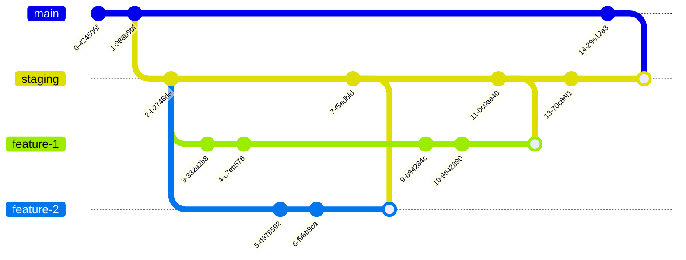

# SIT Openhouse website 🎉
design -> [Figma](https://www.figma.com/file/2131IaOxPgUKKG4P8jeMzT/Openhouse2023?type=design&node-id=0%3A1&mode=design&t=BFTgLYMepp5IG8lH-1)

staging -> [https://openhouse23.thistine.com](https://openhouse23.thistine.com)

prod -> [https://openhouse.sit.kmutt.ac.th](https://openhouse.sit.kmutt.ac.th)

## Development

### Prerequisites 🥹
- If you're using `VScode` 👀
    - Please install the recommend extensions (if you're using vscode you can click `install All` when you first open the project)

- If you're using others IDE 🤖, please find alternative extensions of 
  - 1. vscode-eslint
  - 2. vscode-tailwindcss
  - 3. es7-react-js-snippets
- Install `pnpm` on your local machine

### Development ✍️
- Installing package `pnpm install`
- run project `pnpm dev`

### Project structure 🧱
- All soruce files are localted in `/src` folder 
- There're **4 pages** localted in 4 locations
  - index page (`/`) `/src/app/page.tsx`
  - Agenda page (`/agenda`) `/src/app/agenda/page.tsx`
  - register page (`/register/solution-chllenge`) `/src/app/register/solution-chllenge/page.tsx`
  - info page (`/info`) `scr/app/info/page.tsx`
- `/src/share` folder is used for a *share components, type, function only*. if there's component that only use in a specific page, please consider create `components`, `types` or `utils` folder beside `page.tsx` in a spacific page.

### Deployment
We're using `staging` and `production` enviroment for our project.

In a nutshell, every branch will be merge into staging first before we merge staging into main. ⚡️

